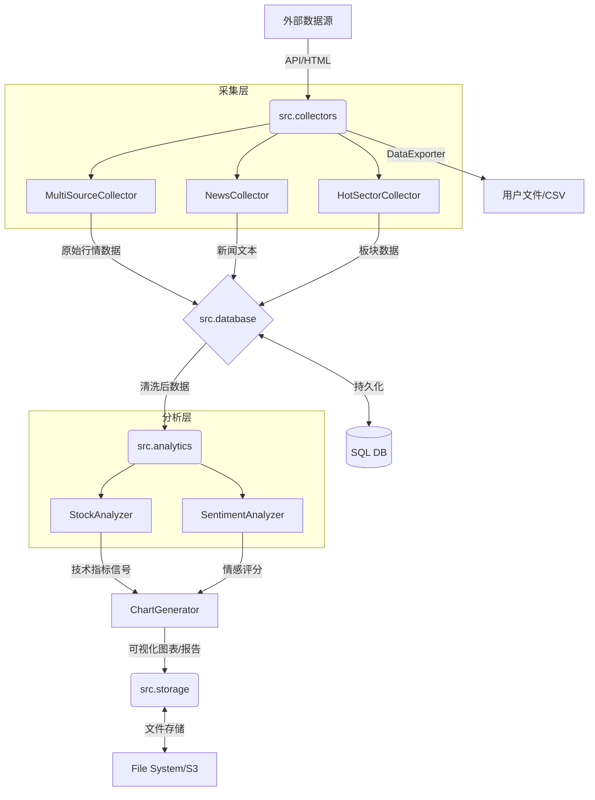

```markdown
# Stock-Collector 架构规范文档

## 文档信息
- **项目名称**: stock-collector
- **版本**: v1.0.0
- **文档状态**: 正式发布
- **最后更新**: 2023-10-27

---

## 1. 系统架构概述

Stock-Collector 是一个基于 Python 的分布式股票数据采集与智能分析系统。系统采用分层架构设计，旨在实现高可用的数据获取、标准化的数据存储以及灵活的分析输出。

### 1.1 设计原则
*   **高内聚低耦合**：各模块独立开发，通过标准接口通信。
*   **可扩展性**：支持插件式添加新的数据源和分析策略。
*   **容错性**：数据采集具备重试机制，数据库连接具备连接池管理。

### 1.2 架构分层
系统逻辑上分为四层：
1.  **采集层**: 负责从多源（交易所API、新闻网站、爬虫）获取原始数据。
2.  **存储层**: 负责数据的持久化，包括元数据管理和文件存储。
3.  **分析层**: 负责对清洗后的数据进行量化计算、情感分析和可视化。
4.  **应用层**: CLI 入口或 API 接口，对外提供服务。

---

## 2. 模块职责说明

### 2.1 `src/collectors/` - 数据采集模块
负责对外部数据的抓取与初步清洗。

*   **`MultiSourceCollector`**: 核心采集调度器，聚合不同券商/数据源的API接口。
    *   职责：统一接口参数，处理不同源的数据格式差异，实现自动降级（主源挂了切备用源）。
*   **`NewsCollector`**: 专注于财经新闻和公告的抓取。
    *   职责：定时轮询目标站点，去重，提取正文文本。
*   **`HotSectorCollector`**: 负责市场热点板块和概念股的追踪。
    *   职责：捕捉板块资金流向，维护板块成分股映射关系。
*   **`DataExporter`**: 数据导出工具。
    *   职责：将内存中的数据导出为 CSV, Excel, JSON 等格式，供外部系统使用。

### 2.2 `src/analytics/` - 数据分析模块
提供量化和非量化的分析能力。

*   **`StockAnalyzer`**: 技术指标计算。
    *   职责：计算 MA, MACD, RSI, KDJ 等指标，生成买卖信号。
*   **`SentimentAnalyzer`**: 自然语言处理（NLP）分析。
    *   职责：对新闻文本进行情感打分（正/负/中性），生成市场情绪指数。
*   **`ChartGenerator`**: 图表可视化。
    *   职责：根据 K 线和分析结果绘制交互式图表（如 Plotly 或 Matplotlib）。

### 2.3 `src/database/` - 数据库管理模块
负责数据的一致性和事务管理。

*   职责：建立数据库连接池，ORM 映射管理，数据表结构迁移。

### 2.4 `src/storage/` - 数据存储模块
与具体数据库实现解耦的抽象存储层（可支持文件系统或对象存储）。

*   职责：二进制文件存储（如生成的图片、PDF报告），大文件路径管理。

---

## 3. 数据流图



---

## 4. 接口规范

### 4.1 采集器基类接口
所有采集器必须继承 `BaseCollector` 并实现 `collect` 方法。

```python
from abc import ABC, abstractmethod
from typing import List, Dict, Any
import pandas as pd

class BaseCollector(ABC):
    """
    采集器基类
    """
    
    @abstractmethod
    def collect(self, symbol: str, start_date: str, end_date: str) -> pd.DataFrame:
        """
        采集数据接口
        
        Args:
            symbol (str): 股票代码
            start_date (str): 开始日期 YYYY-MM-DD
            end_date (str): 结束日期 YYYY-MM-DD
            
        Returns:
            pd.DataFrame: 标准化后的数据DataFrame
        """
        pass
    
    def standardize_columns(self, df: pd.DataFrame, mapping: Dict[str, str]) -> pd.DataFrame:
        """统一列名"""
        return df.rename(columns=mapping)

class MultiSourceCollector(BaseCollector):
    def collect(self, symbol: str, start_date: str, end_date: str) -> pd.DataFrame:
        # 实现具体采集逻辑
        pass
```

### 4.2 数据库操作接口
数据写入需遵循统一的仓储模式。

```python
class DataRepository:
    def save_stock_data(self, df: pd.DataFrame) -> bool:
        """保存股票行情数据"""
        try:
            # 批量插入逻辑
            return True
        except Exception as e:
            # 记录日志
            return False
            
    def get_stock_data(self, symbol: str) -> pd.DataFrame:
        """查询股票数据"""
        pass
```

### 4.3 分析器接口
分析器需接收标准的 DataFrame 并返回结构化结果。

```python
class AnalysisStrategy(ABC):
    @abstractmethod
    def execute(self, df: pd.DataFrame) -> Dict[str, Any]:
        """
        执行分析策略
        
        Returns:
            Dict[str, Any]: 包含分析结果、信号、分数的字典
            Example: {'score': 0.8, 'signal': 'BUY', 'metrics': {...}}
        """
        pass
```

---

## 5. 依赖关系

### 5.1 内部依赖
*   `collectors` 依赖 `database` (用于写入数据)
*   `analytics` 依赖 `database` (用于读取数据) 和 `storage` (保存图片)
*   `collectors` 不应依赖 `analytics`，保持数据流向单向。

### 5.2 外部第三方库 (示例)
```txt
pandas>=1.5.0
numpy>=1.23.0
sqlalchemy>=2.0.0
requests>=2.28.0
beautifulsoup4>=4.11.0
matplotlib>=3.6.0
plotly>=5.10.0
scikit-learn>=1.1.0
```

---

## 6. 扩展性设计

### 6.1 新增数据源
当需要接入新的数据提供商时，只需继承 `BaseCollector`：
1. 在 `src/collectors/` 下创建新文件 `new_provider_collector.py`。
2. 继承 `BaseCollector`，实现 `collect` 方法，将数据转换为统一 DataFrame 格式。
3. 在配置文件中注册该采集器，无需修改核心调度逻辑。

### 6.2 新增分析指标
当需要新增技术分析指标时：
1. 在 `src/analytics/` 下创建新类 `NewIndicatorAnalyzer`。
2. 实现 `AnalysisStrategy` 接口。
3. 主程序通过策略模式动态加载该分析器。

### 6.3 配置驱动
所有数据源连接信息（API Key, 数据库URL）均通过环境变量或 `config.yaml` 管理，不硬编码在代码中。

---

## 7. 部署架构

### 7.1 本地开发模式
直接在本地运行 Python 脚本，数据存储在本地 SQLite 或 CSV 文件。

### 7.2 生产部署模式 (推荐)
采用 Docker 容器化部署。

*   **Collector Service**: 定时任务容器，负责数据采集。
*   **API/Web Service**: 提供 RESTful API，查询分析结果。
*   **Database**: PostgreSQL 或 MySQL 容器。
*   **Redis**: 用于缓存热点数据和任务队列。

### 7.3 目录结构建议
```text
stock-collector/
├── docker-compose.yml
├── Dockerfile
├── requirements.txt
├── config/
│   ├── config.yaml          # 全局配置
│   └── logging.conf         # 日志配置
├── src/
│   ├── collectors/          # 采集模块
│   ├── analytics/           # 分析模块
│   ├── database/            # 数据库模块
│   ├── storage/             # 存储模块
│   └── utils/               # 公共工具
├── tests/                   # 单元测试
└── docs/                    # 文档
    └── ARCHITECTURE.md
```

### 7.4 Docker Compose 示例
```yaml
version: '3.8'
services:
  app:
    build: .
    volumes:
      - ./src:/app/src
      - ./data:/app/data
    environment:
      - DB_HOST=db
      - REDIS_HOST=redis
    depends_on:
      - db
      - redis

  db:
    image: postgres:15
    environment:
      POSTGRES_DB: stock_data
      POSTGRES_USER: user
      POSTGRES_PASSWORD: password
    volumes:
      - pgdata:/var/lib/postgresql/data

  redis:
    image: redis:alpine

volumes:
  pgdata:
```
```